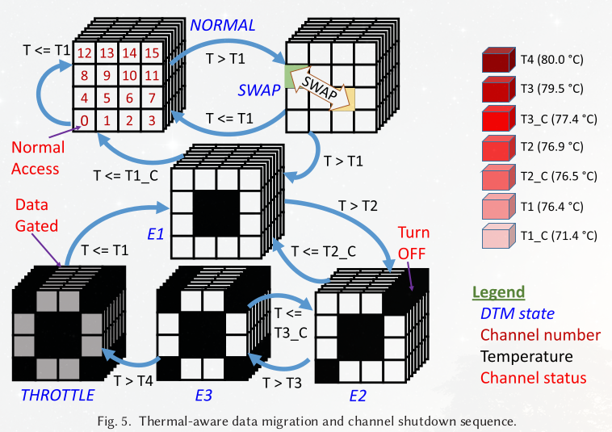
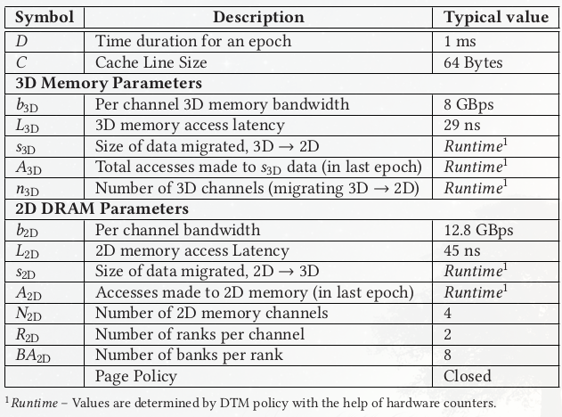

---
geometry:
- top=25mm
- left=20mm
- right=20mm
- bottom=30mm
documentclass: extarticle
fontsize: 12pt
numbersections: true
title: COD310 Notes
--- 

# Stuff to Read
1. 3D memory systems - 3D DRAM
1. Memory leakage power
1. SPEC CPU2006 benchmarks
1. Hybrid Memory Cube (HMC), High Bandwidth Memory (HBM) and Wide IO (WIO)
1. CACTI-3DD

# Doubts
1. What mechanism controls the memory management in memory devices
1. ~~Why is 3D memory better?~~ (resolved)
    - compactness
    - Through Silicon Via - TSV (like?) technology is used

# Leakage-Aware Dynamic Thermal Management of 3D Memories

## Overview (Abstract)
1. Controlling leakage by monitoring temperature
1. Turn off specific memory channels to control temperature (before turning off, migrate data to 2D memory) - **FastCool**
1. **Energy-Efficient FastCool (EEFC)** - decides which channels to be closed

## Introduction
1. 3D memory is stacked 2D DRAM, thus has higher power density
1. Power consumption involves dynamic (48%) and static/leakage power (52%)
1. Static power increases exponentially with temperature, thus a positive feedback between temperature and leakage

## Proposed DTM Strategies

### TAM (Thermal-Aware Migration) States
1. NORMAL
1. SWAP
1. E1 (thermal Emergency 1)
1. E2
1. E3
1. THROTTLE



### Memory Delay Models
2D memory request time = Data Migration Delay (DMD) + Data Access Delay (DAD)



#### DMD
$$DMD = (s_{3D} + s_{2D}) \times \max\left(\frac{1}{B_{3D}}, \frac{1}{B_{2D}}\right)$$
$$B_{3D} = b_{3D} \times n_{3D} \times (1 - \text{3D Memory Refresh Overhead})$$
$$B_{2D} = b_{2D} \times N_{2D} \times (1 - \text{2D Memory Refresh Overhead})$$
$$\text{Refresh Overhead} = \frac{\text{Time required to refresh a row}\times\text{Number of rows}}{\text{Refresh interval}}$$

#### DAD
$$DAD = DAD_B + DAD_L$$
$$A = A_{2D} + A_{3D}\text{, total 2D memory accesses}$$
$$DAD_B = \frac{A \times C}{B_{2D}}$$
$$DAD_L = QD + LD\text{, queuing delay + latency delay}$$

##### Latency Delay
$$LD = \frac{A \times L_{2D}}{BA_{2D} \times R_{2D} \times N_{2D}}$$

##### Queuing Delay
Uses Queuing Theory to model the waiting time. *M/M/1* model is used, having a single queue for each server, and arrival and service rates are Poisson and exponential respectively.
$$QD = \frac{A \times C}{T \times B_{2D}}\times\frac{N_{2D}}{B_{2D} - (A \times C / T)}$$
$$\left(\lambda = \frac{A \times C}{T \times N_{2D}}, \mu = \frac{B_{2D}}{N_{2D}}, \text{expected time} = \frac{\lambda}{\mu\times(\mu - \lambda)}\right)$$

### FastCool
1. Transition to E1 happens only if total access count of channels {5, 6, 9, 10} exceeds $A_{MIN}$ ($A_{MIN} = 160,000$)
$$A_{3D} > A_{MIN}$$
1. Queuing stability needs to be ensured before migrating ($\lambda < \mu$)
$$A < \frac{B_{2D} \times T}{C}$$
1. Ensure transfer to 2D memory happens only if 2D delay is below a certain threshold to prevent slow down of operations
$$Delay < D_{MAX} (= 8.415 ms)$$

### FC Policy Improvements
*later*

### EEFC
*later*

### Leakage Current Estimation
*later*

### DTM Policy Implementation
*later*


# PredictNcool: Leakage Aware Thermal Management for 3D Memories Using a Lightweight Temperature Predictor

## Overview
1. Instead of reacting to temperature changes, this model attempts to utilise predicted temperature changes to reduce application runtime and memory energy
1. Symmetries in floor-plan and other design insights are used to reduct the predictor model parameters


# CoreMemDTM: Integrated Processor Core and 3D Memory Dynamic Thermal Management for Improved Performance

## Overview
Independent thermal management of core and memory leads to inefficient management since both cores and memories slow down


# Project Progress
Given $n$ cores and $k$ 3D memory ranks, with each core accessing memory across all ranks (in some manner), maximise the total instructions per second (IPS) under a memory power budget and a thermal constraint:
$$\max{\sum_i{IPS_i}},$$
$$\sum_r{P_r} \leq P_M$$
$$\underset{r}\max\ {T_r} \leq T_M$$

## Points to Consider
1. Leakage power and temperature have a positive feedback loop
1. The problem formulation is similar to a knapsack problem but more constrained
1. Need to model a formal relation between $P_r$ and $IPS_i$
1. Model needs to be robust enough to be able to work efficiently for different corner cases such as:
  - low power budget
  - no memory accesses
  - high memory accesses
  - specific memory is being accessed more

## Learning Points
1. Types of simulation
    i. Cycle accurate
        - Gem5
    i. Interval based
        - Sniper (read getting started)
        - Repo files - dram_trace_collect, dram_cntrlr, print_trace
1. HotSpot - memory access trace to power trace is converted to temperature trace
    - read how-to

## Basic Background
1. Memories have multiple standard power states
    i. Accessing
    i. Active
    i. Standby
    i. Nap
    i. Powerdown
    i. (a few more?)

## Meeting on 29 December 2021
1. Simulating for HBM2 isn't possible right now because of different memory size of the bank and different area than HBM 

## Initial Algorithm Sketch - RL Based

### Assumption
1. Only two power states are considered: $p_{low}, p_{high}$ ($p_{low}$ is power when just storing the value, $p_{high}$ is power when bank being read from or written to).
1. The power budget $P$ is enough to at least service one bank per cycle, i.e., $P \geq (n - 1)\times p_{low} + p_{high}$.
1. The temperature constraint is given as $T_M$

### Algorithm
We first compute the maximum number of banks, $m$, that can be serviced per cycle using the following equation:
$$m\cdot p_{high} + (n - m)\cdot p_{low} = P$$
$$\implies m = \frac{P - n\cdot p_{low}}{p_{high} - p_{low}}$$

Now, we propose the following algorithm while relaxing the temperature constraint
```py
if num_requests <= m:
  service all banks
else:
  service those m banks which have highest priority
```

We first define $priority$ as follows:
$$priority(bank_i) = f(\text{number of memory accesses at }bank_i\text{ in previous }c\text{ cycles})\times b_a +$$
$$f(\text{number of memory accesses }core(bank_i)\text{ in previous }c\text{ cycles})\times c_a$$
Where $f$ is given as:
$$f(x) = \max(x, c - \alpha\cdot x)$$
The above equation is parameterised by $c, b_a, c_a, \alpha$.

We then incorporate the temperature of the banks by penalising the priority:
$$priority_T(bank_i) = priority(bank_i) - temp(bank_i)\times t_p - \max(temp(neighbours(bank_i)))\times t_p'$$
This is parameterised by $c, r_b, r_c, w_b, w_c, t_p, t_p', neighbours(\cdot)$. We can be flexible with the definition of $neighbours$ for different banks to accommodate the temperature contributions of neighbours.

These parameters can be computed using an RL algorithm or can be computed analytically looking at the contributions of each parameter to the temperature of the banks and IPS of the cores.

## Knapsack Based Algorithm

### Points
1. The algorithm uses two constraints - one for power budget and one for temperature
1. The approach can be extended to incorporate multiple power states

### Algorithm Sketch
1. Number of "bags" = n (number of banks)
1. Budget 1 = P (power budget)
1. $w_{1i} = p_i$ (power consumed by bank $i$ if it is turned on)
1. Budget 2 = $T_X$ (experimentally determined value)
1. $w_{2i} = \alpha T_i + (1-\alpha)f(i)$, if $T_i < T_{threshold}$ else $\infty$ ($f(i)$ is weighted average of temperature of neighbours)
1. $c_i = activity_i$ (the cost of each bank is the memory activity)

### Time Complexity of Algorithm
1. Since we have two constraints, the time complexity will be $O(n \times P \times T_X)$ for solving the knapsack
1. The time complexity for computing $w_{1i}$ will be $O(n)$ since the power is directly obtained
1. Complexity to compute $w_{2i}$ will be $O(n \times \epsilon)$ where $\epsilon$ is average degree of the banks (degree = number of neighbours)
1. Complexity to compute $c_i$ will be $O(n)$ since the value is incremented on every memory operation (we just need to have a counter and a queue for each bank)

Total complexity of the algorithm is: $O(n \times P \times T_X + n \times (2 + \epsilon))$

## Meeting on 12 May
1. Different leakage powers for different states
1. Transition power needs to be accounted?
1. Multiple power states isn't straight forward and further thought needs to be given
1. Scaling factor needs to be used as a parameter for the knapsack algorithm
